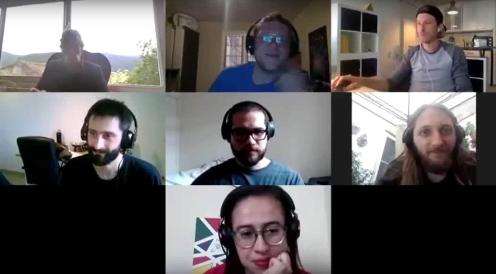

# The-Catalyst-School

## Overview

Catalyst School, a place to leverage the impact of Catalyst as a whole by improving the contribution of all its different players and roles

## How to Learn?

The Catalyst School aims to be a place not only to learn, but also to meet and interact with other community members. Actually, we believe that one of the best ways to learn is exactly by doing that: through open conversations, exchanging knowledge and having hands-on experiences on what it looks like to act in Catalyst as a proposer, CA, vCA and other roles that might come up. For that, the School will have classes and workshops during each Fund that will be open for everyone who is willing to participate.

For those who prefer not or are not available to go to classes and workshops, at each Fund we will provide a limited number of 1-to-1 support with our team members.

Also, we know that there are some people who prefer not to have all this interaction, and like to learn at their own pace. For those, all the School materials and references will be openly available on our website, with the recordings of live sessions and all text and audiovisual content used there.

