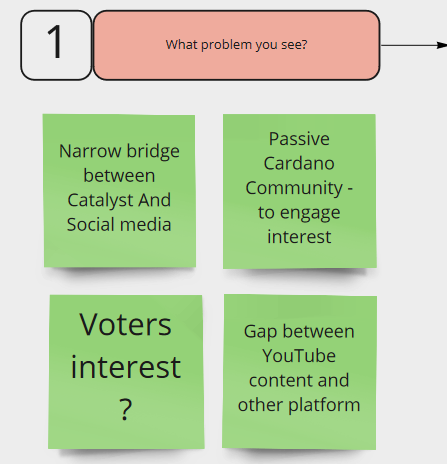
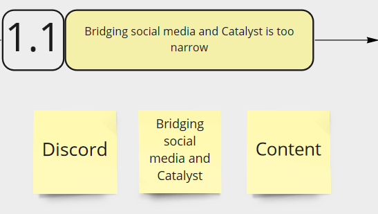
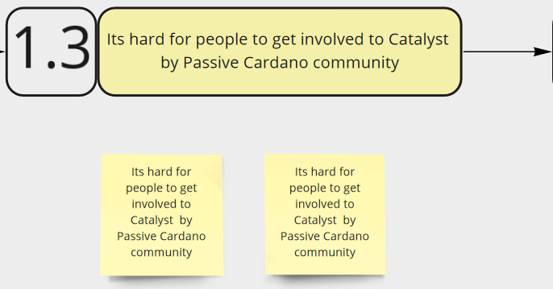
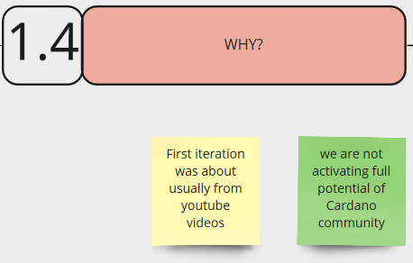
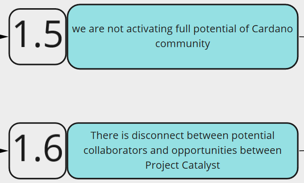
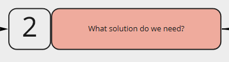

# First Iteration - Saturday Swarm 24th July 2021

## Mini Proposal Design Process - Saturday Swarm 24th July 2021

### A linear transcription \(text description\). First Iteration of possible course materials.

## Chapter 1 - Problem Statement

### 1.0 - What Problem do you see ?

Narrow bridge between Catalyst And Social media.

Passive Cardano Community - to engage interest.

Voters interest ?

Gap between YouTube content and other platform.

### 1.1 - Bridging social media and Catalyst is too narrow

Bridging social media and Catalyst Discord content

### 1.2 - Why ?

### 1.3 - Its hard for people to get involved to Catalyst by Passive Cardano community

Its hard for people to get involved to Catalyst by Passive Cardano community.

### 1.4 - Why ?

First iteration was about usually from YouTube videos.

We are not activating full potential of Cardano community.

Fragmentation of the community creates fragmentation in action.

Less aligned cooperation.

Power of Co-intelligence is getting wasted.

Lack of awareness how we could be involved.

Unrealized potential.

There is disconnect between potential collaborators and opportunities between Project Catalyst.

### 1.5 - We are not activating full potential of Cardano community.

### 1.6 - There is disconnect between potential collaborators and opportunities between Project Catalyst.

## Chapter 2 - Describe your Solution to the Problem.

### 2.0 - What solution do we need?

#### How to sign up, how to register, etc

Answers to frequently answered questions - as frequent questions can cause roadblocks.

#### Simple Info-graphics

Easy to consume video content and short clips.

Harder to convert passive person.

Categorized Library of content.

Nice pictures.

Easier to consume Catalyst Process.

#### Social Media Strategy

Timely content that is relevant to specific events.

Summaries before detail.

#### Target Audience?

Where is the attention?

Twitter.

TikTok.

Facebook.

#### Content

Library of content - that multiple content creators can feed into.

Podcast to be broken into 10 key points - which can be broken down

### 2.1 - \(Simple\) Infographics about the Catalyst process on Twitter

### 2.2 - Up to date information in what state you are in process on Twitter

### 2.3 - Does your solution answers the Selected Problem?

### 2.4 - Why ?

