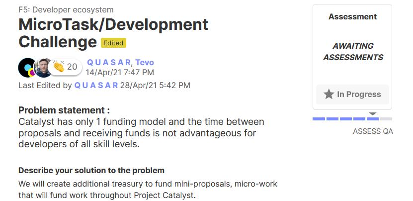

# MicroTask/Development Challenge

## Overview

In order to develop training materials the Catalyst School is partnering with Tevo and Quasar on their Fund 5 - Developer ecosystem MicroTask/Development Challenge.



## Workshop Iterations

To date there have been the following iterations of the MicroTask Catalyst School Workshop

1\) Saturday Swarm Session of 24th July 2021, hosted by Tevo and supported by Stephen.

2\) After Town Hall of the 28th July 2021, hosted by Tevo and supported by Stephen.

These workshops invited submissions of mini-proposals from Proposers and participation from Community Advisors.

