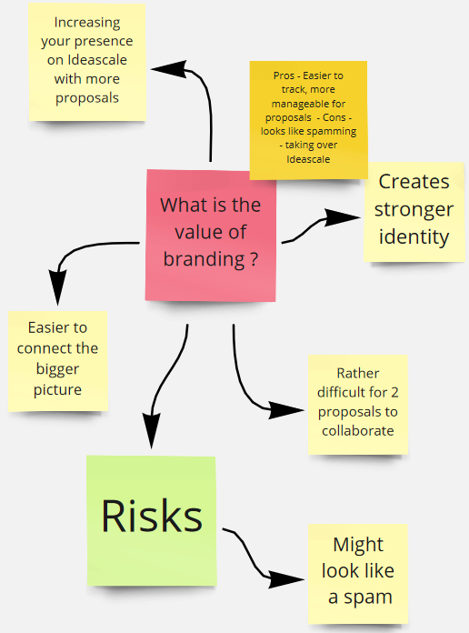
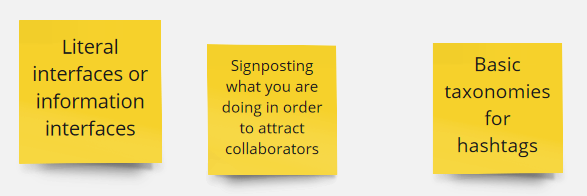
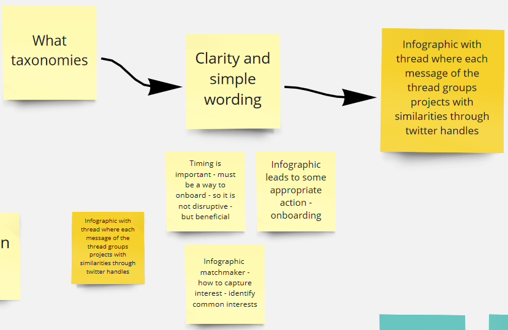
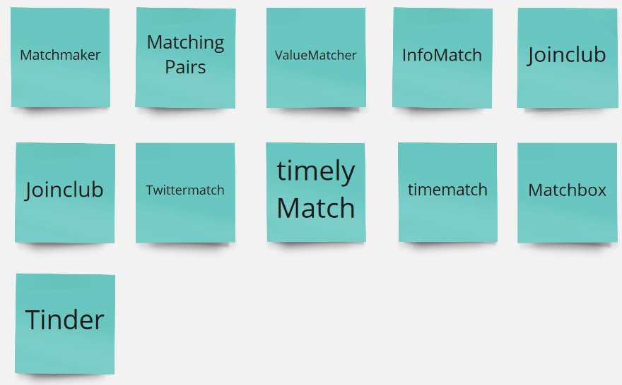
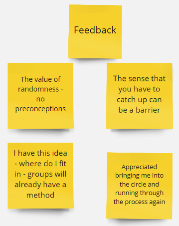

# Second Iteration - After Town Hall

## 3 - Have a searchable name for mini proposals if you have many similar proposals.

### What is the value of branding ?

## 3.1 - Find a Name for your Proposal. But maybe think about a Name which is related to the Problem you want to solve by your Proposal.

### Common Interfaces, Common Goals and Common Tech.

### Basic taxonomies for hashtags

### What taxonomies ?

## 3.2 - Brainstorm a Name and then Vote for the best Name/Title/Brand etc.

## Feedback

## Miro Board Link



