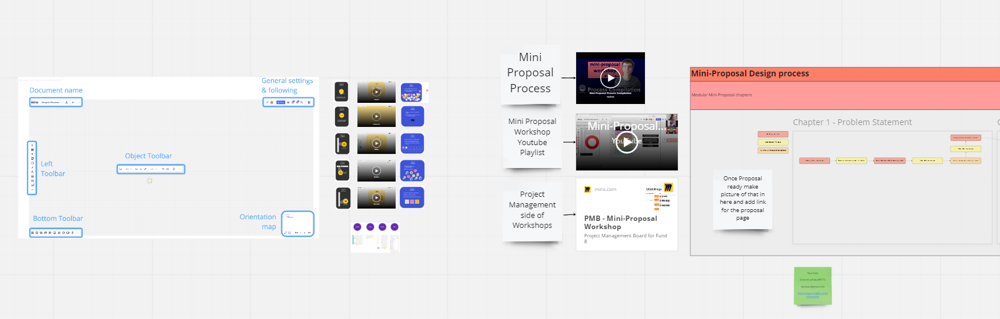

# Roles

### Roles in Project Catalyst


Shirah is a happy sprite who helped Catalyst School to design and put Introduction to Catalyst content together


Project Catalyst has multiple roles that are paid by Project Catalyst.\
You are able to have an impact on collective knowledge with just a few engagements.

**Proposer -** Got an idea?\
Create an impactful proposal and collaborate with the community to refine it.\
[Project Catalyst - Proposal Template by Felix](https://docs.google.com/document/d/185Dj\_t07C2LJQO1tif1aXhq\_1zqZ-3RsGZAvS7mtiyI/edit?usp=sharing)

**Community Advisor / Proposal Assessor** - Provide reviews and assessments.\
Mentor proposers in their delivery and presentation.\
From Fund 9 the official role name is Proposal Assessor.\
[Community Advisor Assessment Guide - Fund8 (official)](https://docs.google.com/document/d/1g-iZhDlKhUBZkui1uv8NVNfJC4oVD3JtR-P6Fue7XPU/edit)

**Voter** - Choose proposals that should get funding.\
[Voter Registration and Voting Guide\
](https://iohk.zendesk.com/hc/en-us/articles/900005679386)Try voting for fund 8 Proposals on a community-created tool:\
[https://cardanocataly.st/voter-tool/#/](https://cardanocataly.st/voter-tool/#/)

**Catalyst Governance Group** - Sensor problems and helps us improve Project Catalyst and collaboration between evergrowing communities.\
Governance group introduction: [Catalyst Circle](https://docs.google.com/document/d/1af24MHCXI3nbyN4Z0vItmWtvrySsBcurUUeCK3JDLnU/edit?usp=sharing)\
[Project Catalyst - Funded Projects Reporting (public MVP)](https://docs.google.com/spreadsheets/d/1bfnWFa94Y7Zj0G7dtpo9W1nAYGovJbswipxiHT4UE3g/edit#gid=938310766)&#x20;


Introduction To Catalyst - Roles (website edition)

